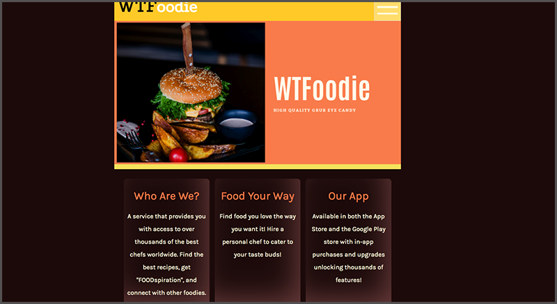
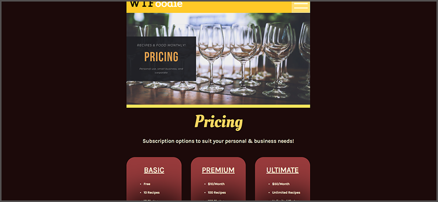

# WTFoodie

WTFoodie is an app idea designed for professional chefs to be able to show off their food photos and recipes. The overall concept is to provide chefs with a simple & professional way to showcase their work and allow regular users to hire them for events & personal use.

 

 
 

# The Team

**Web UI Developers**

- Colby Howell - Louisiana, USA - <a href="https://github.com/colbyhowell" target="_blank">GitHub</a>
- Jashele Tillman - Arizona, USA - <a href="https://github.com/jasheloper" target="_blank">GitHub</a>

 
 

# Additional Links

- <a href="https://github.com/super-foodie-fans" target="_blank">GitHub Organization</a>

